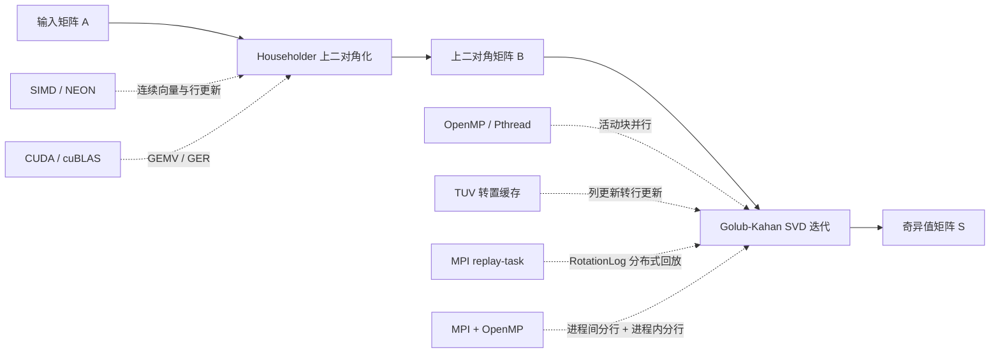

# Parallel-SVD-Final-Project

[](https://isocpp.org/)
[](https://developer.nvidia.com/cuda-toolkit)
[](https://www.openmp.org/)
[](https://www.mpi-forum.org/)
[](LICENSE)

南开大学《并行程序设计》课程期末项目：围绕矩阵奇异值分解（SVD），综合使用 **SIMD、Pthread/OpenMP、MPI 与 CUDA/cuBLAS**，研究不同算法阶段与不同并行层级之间的匹配关系。

本项目不是将四种并行技术简单叠加到同一段代码上，而是围绕 SVD 的两阶段结构进行针对性设计：

1. 使用 Householder 变换将矩阵约化为上二对角矩阵；
2. 使用 Golub–Kahan SVD 迭代将上二对角矩阵收敛为奇异值对角矩阵；
3. 对规则、连续的 Householder 运算使用 SIMD 与 GPU；
4. 对依赖关系复杂的 GKH 迭代，从活动块任务、数据布局、通信粒度和层次化并行角度进行优化。

> 核心结论：并行优化的关键不是“用了多少种并行技术”，而是并行粒度、访存模式、通信开销与算法依赖是否匹配。

---

## 目录

- [项目概览](#项目概览)
- [算法流程](#算法流程)
- [主要优化](#主要优化)
- [项目结构](#项目结构)
- [环境要求](#环境要求)
- [快速开始](#快速开始)
- [编译选项与环境变量](#编译选项与环境变量)
- [MPI 实验复现](#mpi-实验复现)
- [正确性验证](#正确性验证)
- [实验结果](#实验结果)
- [Profiling 分析](#profiling-分析)
- [实验结论](#实验结论)
- [已知限制与后续工作](#已知限制与后续工作)
- [课程实验脉络](#课程实验脉络)
- [许可证](#许可证)

---

## 项目概览

对于输入矩阵 \(A\in\mathbb{R}^{m\times n}\)（当前实现要求 \(m\ge n\)），程序计算

\[
A = U S V^T,
\]

其中：

- \(U\in\mathbb{R}^{m\times m}\) 为正交矩阵；
- \(V\in\mathbb{R}^{n\times n}\) 为正交矩阵；
- \(S\in\mathbb{R}^{m\times n}\) 的主对角元素为非负、降序排列的奇异值。

项目采用两阶段实现：

```text
A
│
├─ Householder 上二对角化
│     A = U B V^T
│
└─ Golub-Kahan SVD 迭代
      B -> S
      A = U S V^T
```

整体优化思路如下：



---

## 算法流程

### 第一阶段：Householder 上二对角化

通过左右 Householder 变换，逐步消除主对角线和超对角线之外的元素：

\[
A \longrightarrow B,
\qquad
A = U B V^T.
\]

该阶段包含大量：

- 向量范数与内积；
- 矩阵–向量乘法；
- 秩一更新；
- 连续行或列上的线性组合。

这些运算规则、数据规模大，适合 SIMD 与 GPU/cuBLAS。

### 第二阶段：Golub–Kahan SVD 迭代

对上二对角矩阵 \(B\) 使用 Wilkinson shift 与 Givens 旋转执行 bulge chasing，使超对角线逐渐收敛为零。

每个活动块 \([l,r]\) 内部存在严格的追赶顺序，但不同活动块之间在数学上独立。该阶段的主要困难是：

- 初始阶段往往只有一个大活动块；
- block 内 bulge chasing 具有顺序依赖；
- \(U/V\) 的列旋转在 row-major 存储下访存局部性较差；
- MPI 中若直接传输局部 \(B\)，通信量和 master 端合并开销很高。

---

## 主要优化

### 1. SIMD 与连续行更新

早期 SIMD 实验主要对连续行更新进行 NEON 向量化。对两个连续矩阵行执行 Givens 线性组合时，可以一次处理多个 `double` 元素。

这一阶段得到的重要结论是：

- 行更新的数据连续，适合 SIMD；
- 列更新在 row-major 布局下是跨步访问，SIMD 与 cache 利用率均受限；
- 访存模式与数据布局往往比单纯增加算术并行度更关键。

这一观察最终演化为期末项目中的 TUV 转置缓存优化。

### 2. Pthread/OpenMP 活动块并行

GKH 每轮迭代通过超对角线断点划分活动块。不同非平凡活动块互不重叠，因此可以并行执行。

项目支持：

- Pthread 动态任务分发；
- OpenMP `parallel for`；
- 多种 OpenMP 调度策略；
- 线程数环境变量控制。

OpenMP 调度策略：

| `OMP_SCHEDULE_KIND` | 调度方式 |
|---:|---|
| `0` | `schedule(static)` |
| `1` | `schedule(dynamic, 1)` |
| `2` | `schedule(dynamic, 2)` |
| `3` | `schedule(guided)` |

局限在于：随机大矩阵的早期通常只有一个大活动块，block 内部又不能任意拆分，因此线程数增加并不一定带来单调加速。

### 3. CUDA/cuBLAS 上二对角化

GPU 版本将 Householder 上二对角化中的核心线性代数运算迁移至 CUDA/cuBLAS：

- `cublasDgemv`：矩阵–向量乘法；
- `cublasDger`：秩一更新；
- 自定义 CUDA GER kernel：作为 cuBLAS GER 的对照实现；
- CUDA kernel：执行结构清理与局部更新。

GER 后端可以通过环境变量切换：

```bash
SVD_GER=cublas
```

或：

```bash
SVD_GER=custom
```

除显式设置为 `custom` 外，默认使用 cuBLAS `cublasDger`。

### 4. TUV 转置缓存优化

TUV（Transposed U/V Cache）是本项目在单机 GKH 阶段中的核心新增优化。

原始 GKH 需要维护：

\[
A = U B V^T.
\]

当 \(B\) 右乘 Givens 旋转 \(R\) 时：

\[
V \leftarrow V R.
\]

当 \(B\) 左乘 Givens 旋转 \(L\) 时：

\[
U \leftarrow U L^T.
\]

在 row-major 存储下，这两类操作都表现为矩阵的两列更新，跨步访问会造成较差的 cache line 利用率。

TUV 维护：

\[
UT = U^T,\qquad VT = V^T.
\]

于是：

\[
V \leftarrow VR
\quad\Longleftrightarrow\quad
VT \leftarrow R^T VT,
\]

\[
U \leftarrow UL^T
\quad\Longleftrightarrow\quad
UT \leftarrow L UT.
\]

原来的列更新由此转化为转置矩阵上的连续行更新，可以复用 `apply_left_rows` 的连续访存与 SIMD 优化逻辑。

TUV 通过编译参数开启：

```bash
make gpu TUV=1
```

该设计没有改变 GKH 的数学过程，只改变了 \(U/V\) 累积旋转的数据组织方式。

### 5. MPI block-task

原 MPI 版本采用 master-worker 模型：

1. rank 0 保存完整 \(U/B/V\)；
2. master 将活动块 \([l,r]\) 对应的局部 \(B\) 发送给 worker；
3. worker 对局部块执行 GKH，返回更新后的局部 \(B\)、新 block 与 RotationLog；
4. master 合并局部矩阵并串行回放旋转。

这种设计保持了活动块层面的数学独立性，但存在明显问题：

- 初始活动块数量有限；
- 大量局部 \(B\) 被反复发送和接收；
- master 需要串行合并并回放日志；
- worker 等待和通信时间占比高。

### 6. MPI replay-task

replay-task 不再以“活动子块计算”作为 MPI 任务，而是重新定义任务粒度：

1. rank 0 串行推进 \(B\) 的 GKH 迭代；
2. 每轮记录产生的 Givens `RotationLog`；
3. 将日志广播给所有 MPI rank；
4. \(U/V\) 按行划分到不同 rank；
5. 每个 rank 仅对本地行切片回放相同日志；
6. 收敛后将本地 \(U/V\) 行切片 gather 回 rank 0。

对于固定的 Givens 旋转，不同行之间互不依赖，因此按行分布是安全的。

相比 block-task，通信内容从局部矩阵转变为紧凑的旋转日志，显著降低了通信量和 master 端回放压力。

### 7. MPI + OpenMP hybrid replay

hybrid 版本在 replay-task 基础上进一步分层：

- **MPI**：跨进程划分 \(U/V\) 行区间；
- **OpenMP**：在每个 rank 内继续划分本地行区间；
- 每个线程按原顺序回放全部 RotationLog。

```text
全局 U/V
│
├─ MPI rank 0：一段行区间
│    ├─ OpenMP thread 0
│    ├─ OpenMP thread 1
│    ├─ OpenMP thread 2
│    └─ OpenMP thread 3
│
└─ MPI rank 1：另一段行区间
     ├─ OpenMP thread 0
     ├─ OpenMP thread 1
     ├─ OpenMP thread 2
     └─ OpenMP thread 3
```

该设计避免了 MPI 和 OpenMP 同时争抢“活动块”这一有限并行度。实验配置为：

```text
2 MPI ranks × 4 OpenMP threads = 8 CPU cores
```

---

## 项目结构

```text
Parallel-SVD-Final-Project/
├── .gitignore
├── LICENSE
├── README.md
├── Makefile
├── main.cpp
├── matrix.h
├── givens.h
├── bidiagonalization.cpp
├── bidiagonalization.h
├── bidiagonalization_cuda.cu
├── bidiagonalization_cuda.h
├── gkh.cpp
├── gkh.h
├── gkh_openmp_cuda.cpp
├── gkh_serial_baseline.cpp
├── logs/
│   ├── schedule/
│   ├── CPU_baseline.txt
│   ├── CUDA+cuBLAS_GER.txt
│   ├── CUDA+custom_GER.txt
│   ├── check_normal_openmp_t2.txt
│   ├── check_tuv_openmp_t1.txt
│   ├── check_tuv_openmp_t2.txt
│   ├── check_tuv_openmp_t8.txt
│   ├── cpu_openmp_gkh_*.txt
│   ├── cuda_cublas_openmp_gkh_*.txt
│   ├── cuda_custom_openmp_gkh_8.txt
│   └── final_cuda_cublas_tuv_t2.txt
└── MPI_replay_optimize/
    ├── main.cpp
    ├── matrix.h
    ├── givens.h
    ├── bidiagonalization.cpp
    ├── bidiagonalization.h
    ├── gkh.cpp
    ├── gkh.h
    ├── qsub_mpi.sh
    ├── qsub_mpi_hybrid.sh
    └── results/
        ├── block_np8/
        │   └── mpi_profile_np8.csv
        ├── replay_np8/
        │   └── mpi_profile_replay_np8.csv
        └── hybrid_np2_omp4/
            └── mpi_profile_hybrid_np2.csv
```

主要文件说明：

| 文件 | 作用 |
|---|---|
| `main.cpp` | 构造测试矩阵、选择后端、计时与正确性验证 |
| `matrix.h` | 简单矩阵类与基础存储接口 |
| `bidiagonalization.cpp` | CPU Householder 上二对角化 |
| `bidiagonalization_cuda.cu` | CUDA/cuBLAS Householder 上二对角化 |
| `gkh.cpp` | OpenMP/Pthread GKH 与 TUV 主版本 |
| `gkh_openmp_cuda.cpp` | OpenMP/CUDA 融合过程中的对照实现 |
| `gkh_serial_baseline.cpp` | GKH 串行基线参考 |
| `logs/` | 单机实验输出、线程数与调度策略对照日志 |
| `MPI_replay_optimize/gkh.cpp` | block-task、replay-task 与 hybrid replay 的统一 MPI 实现 |
| `MPI_replay_optimize/results/` | 三类 MPI 实验的 profiling 结果 |

---

## 环境要求

### CPU / OpenMP

- Linux；
- GCC / G++，支持 C++17；
- OpenMP；
- Pthread；
- GNU Make。

推荐：

```text
g++ >= 9
```

### CUDA / cuBLAS

- NVIDIA GPU；
- CUDA Toolkit；
- cuBLAS；
- 当前 `Makefile` 默认使用 `-arch=sm_86`。

该配置适用于 Compute Capability 8.6 GPU。若使用其他 GPU，请修改 `Makefile` 中的 `NVCCFLAGS`。

项目单机实验环境：

```text
GPU: NVIDIA RTX 3090 24GB
nvcc: CUDA Toolkit 11.8
目标架构: sm_86
```

### MPI

- `mpic++`；
- MPI 运行时；
- 多节点实验需要 SSH/共享目录或可执行文件分发机制；
- 仓库中的 `qsub_*.sh` 针对学校 PBS/Torque 集群编写。

> `qsub_mpi.sh` 与 `qsub_mpi_hybrid.sh` 中包含 `master_ubss1` 和 `/home/${USER}/svd` 等集群相关路径。在其他环境复现时需要修改这些路径。

---

## 快速开始

### 1. 克隆仓库

```bash
git clone https://github.com/aaaaa985/Parallel-SVD-Final-Project.git
cd Parallel-SVD-Final-Project
```

### 2. CPU / OpenMP 版本

```bash
make clean
make cpu
SVD_GKH_THREADS=2 ./svd_cpu 20260410
```

也可以通过环境变量设置随机种子：

```bash
SVD_SEED=20260410 ./svd_cpu
```

### 3. GPU / cuBLAS 版本

```bash
make clean
make gpu
```

使用 CUDA 上二对角化和默认 cuBLAS GER：

```bash
SVD_BACKEND=cuda SVD_GER=cublas SVD_GKH_THREADS=2 ./svd_gpu 20260410
```

使用自定义 GER kernel：

```bash
SVD_BACKEND=cuda SVD_GER=custom SVD_GKH_THREADS=2 ./svd_gpu 20260410
```

### 4. CUDA + OpenMP + TUV 最终单机版本

```bash
make clean
make gpu TUV=1 OMP_SCHEDULE_KIND=3
```

运行：

```bash
SVD_BACKEND=cuda SVD_GER=cublas SVD_GKH_THREADS=2 ./svd_gpu 20260410
```

程序会打印类似：

```text
Bidiagonalization backend: CUDA/cuBLAS
GKH backend: OpenMP block parallel + transposed U/V cache
OpenMP schedule kind: 3
```

---

## 编译选项与环境变量

### Makefile 参数

| 参数 | 默认值 | 说明 |
|---|---:|---|
| `TUV` | `0` | 设置为 `1` 时定义 `USE_TRANSPOSED_UV` |
| `OMP_SCHEDULE_KIND` | `3` | OpenMP 活动块调度策略 |
| `NVCCFLAGS` | `-O3 -std=c++17 -arch=sm_86` | CUDA 编译参数 |

示例：

```bash
make gpu TUV=1 OMP_SCHEDULE_KIND=0
```

### 运行时环境变量

| 环境变量 | 可选值/示例 | 说明 |
|---|---|---|
| `SVD_BACKEND` | `cpu` / `cuda` | 只有显式设为 `cuda` 才启用 CUDA 上二对角化 |
| `SVD_GER` | `cublas` / `custom` | 选择 GER 后端；默认 cuBLAS |
| `SVD_GKH_THREADS` | `1`、`2`、`4`、`8` 等 | 设置 GKH OpenMP 线程数 |
| `OMP_NUM_THREADS` | 正整数 | 未设置 `SVD_GKH_THREADS` 时作为回退 |
| `SVD_SEED` | 整数 | 设置随机种子 |

线程数优先级：

```text
SVD_GKH_THREADS
    > OMP_NUM_THREADS
    > omp_get_max_threads()
    > 默认 8
```

---

## MPI 实验复现

进入 MPI 子目录：

```bash
cd MPI_replay_optimize
```

### 1. 原 MPI block-task

```bash
mpic++ -O2 -std=c++17   main.cpp gkh.cpp bidiagonalization.cpp   -o main -lpthread

mpiexec -np 8 ./main 20260410
```

PBS 集群：

```bash
qsub qsub_mpi.sh
```

### 2. MPI replay-task

```bash
mpic++ -O2 -std=c++17   -DUSE_MPI_REPLAY_TASKS   main.cpp gkh.cpp bidiagonalization.cpp   -o main -lpthread

mpiexec -np 8 ./main 20260410
```

在项目所使用的 PBS 环境中，编译完成后同样可调用：

```bash
qsub qsub_mpi.sh
```

### 3. MPI + OpenMP hybrid replay

```bash
mpic++ -O2 -std=c++17   -DUSE_MPI_REPLAY_TASKS   -DUSE_OPENMP   -DUSE_OPENMP_LOCAL_REPLAY   main.cpp gkh.cpp bidiagonalization.cpp   -o main -lpthread -fopenmp
```

运行：

```bash
export OMP_NUM_THREADS=4
export OMP_PROC_BIND=spread
export OMP_PLACES=cores

mpiexec -np 2 ./main 20260410
```

PBS 集群：

```bash
qsub qsub_mpi_hybrid.sh
```

正确进入 hybrid 路径时会输出：

```text
[MPI GKH mode] MPI_REPLAY_TASKS + OPENMP_LOCAL_REPLAY, mpi_size=2
```

---

## 正确性验证

程序同时验证运行时间与 SVD 数值正确性：

| 指标 | 含义 | 判定阈值 |
|---|---|---:|
| `||A-U*S*V^T||_F` | 绝对重构误差 | 辅助观察 |
| `relative recon error` | 相对重构误差 | `< 1e-8` |
| `||U^T U-I||_F` | \(U\) 正交性误差 | `< 1e-7` |
| `||V^T V-I||_F` | \(V\) 正交性误差 | `< 1e-7` |
| `diagonal structure error` | 最终非对角结构误差 | `< 1e-10` |
| `descending order error` | 奇异值降序误差 | `< 1e-12` |
| `nonnegative diagonal` | 奇异值是否非负 | 必须为 `yes` |
| `converged` | GKH 是否收敛 | 必须为 `yes` |

每次运行包含 5 组内置测试，结尾输出：

```text
通过: 5 / 5
```

---

## 实验结果

主要实验固定随机种子为：

```text
20260410
```

### 单机异构结果

测试矩阵：随机 \(1000\times1000\)。

| 版本 | Bidiag / ms | GKH / ms | 总计 / ms | 相对 CPU 基线 |
|---|---:|---:|---:|---:|
| CPU baseline | 2455.66 | 11522.90 | 13978.56 | 1.00× |
| CUDA/cuBLAS + serial GKH | 165.91 | 10751.20 | 10917.11 | 1.28× |
| CUDA/cuBLAS + ordinary OpenMP GKH | 169.78 | 9654.10 | 9823.88 | 1.42× |
| CUDA/cuBLAS + TUV OpenMP GKH | 166.17 | 3683.60 | 3849.77 | **3.63×** |

代表性日志：

- [`logs/CPU_baseline.txt`](logs/CPU_baseline.txt)
- [`logs/CUDA+cuBLAS_GER.txt`](logs/CUDA+cuBLAS_GER.txt)
- [`logs/CUDA+custom_GER.txt`](logs/CUDA+custom_GER.txt)
- [`logs/check_normal_openmp_t2.txt`](logs/check_normal_openmp_t2.txt)
- [`logs/check_tuv_openmp_t1.txt`](logs/check_tuv_openmp_t1.txt)
- [`logs/check_tuv_openmp_t2.txt`](logs/check_tuv_openmp_t2.txt)
- [`logs/check_tuv_openmp_t8.txt`](logs/check_tuv_openmp_t8.txt)
- [`logs/final_cuda_cublas_tuv_t2.txt`](logs/final_cuda_cublas_tuv_t2.txt)

### TUV 消融结果

| 版本 | 线程数 | GKH / ms |
|---|---:|---:|
| ordinary OpenMP | 2 | 9654.10 |
| TUV OpenMP | 1 | 3979.72 |
| TUV OpenMP | 2 | **3683.60** |
| TUV OpenMP | 8 | 4172.10 |

TUV 单线程已经明显快于普通 OpenMP 2 线程，说明主要收益来自访存局部性，而不是线程数本身。

### MPI 结果

测试矩阵：随机 \(1000\times1000\)。

| 版本 | 配置 | Bidiag / ms | GKH / ms | 总计 / ms | 结果 |
|---|---|---:|---:|---:|---|
| MPI block-task | 8 MPI ranks | 4607.86 | 42336.60 | 46944.46 | PASS |
| MPI replay-task | 8 MPI ranks | 4509.44 | 8044.31 | 12553.75 | PASS |
| MPI + OpenMP hybrid replay | 2 MPI ranks × 4 threads | 4417.12 | **7084.94** | 11502.06 | PASS |

GKH 阶段加速：

```text
block-task -> replay-task : 42336.60 / 8044.31 ≈ 5.26×
block-task -> hybrid      : 42336.60 / 7084.94 ≈ 5.98×
replay-task -> hybrid     : 8044.31 / 7084.94 ≈ 1.14×
```

> 单机异构实验与 MPI 实验运行在不同硬件环境上，不应直接用两个表的绝对时间判断 CUDA 与 MPI 的优劣。MPI 表主要比较同一集群环境下不同任务粒度与通信设计。

---

## Profiling 分析

### 原 MPI block-task

| 指标 | 数值 |
|---|---:|
| 向 worker 发送数据 | 2,669,416,600 B |
| 从 worker 接收数据 | 2,712,913,912 B |
| 总通信量 | 约 5.38 GB |
| master 等待结果 | 15001.10 ms |
| master 接收 payload | 13550.60 ms |
| master 回放日志 | 5918.65 ms |
| GKH 总时间 | 42336.60 ms |

Profile：

- [`MPI_replay_optimize/results/block_np8/mpi_profile_np8.csv`](MPI_replay_optimize/results/block_np8/mpi_profile_np8.csv)

### MPI replay-task

| 指标 | 数值 |
|---|---:|
| `master_b_compute_ms` | 6318.71 ms |
| `log_pack_ms` | 22.16 ms |
| `log_bcast_ms` | 798.71 ms |
| `local_replay_ms` | 710.81 ms |
| `gather_ms` | 78.21 ms |
| 广播数据量 | 43,475,168 B |
| gather 数据量 | 28,000,000 B |
| 总通信量 | 约 71.48 MB |

通信量较原 block-task 约降低：

```text
5.38 GB / 71.48 MB ≈ 75×
```

Profile：

- [`MPI_replay_optimize/results/replay_np8/mpi_profile_replay_np8.csv`](MPI_replay_optimize/results/replay_np8/mpi_profile_replay_np8.csv)

### MPI + OpenMP hybrid replay

| 指标 | 数值 |
|---|---:|
| `master_b_compute_ms` | 5978.30 ms |
| `log_pack_ms` | 19.62 ms |
| `log_bcast_ms` | 174.33 ms |
| `local_replay_ms` | 720.60 ms |
| `gather_ms` | 73.89 ms |
| 广播数据量 | 43,475,168 B |
| gather 数据量 | 16,000,000 B |
| 总通信量 | 约 59.48 MB |

rank 0 推进 \(B\) 的占比约为：

```text
5978.30 / 7084.94 ≈ 84.4%
```

Profile：

- [`MPI_replay_optimize/results/hybrid_np2_omp4/mpi_profile_hybrid_np2.csv`](MPI_replay_optimize/results/hybrid_np2_omp4/mpi_profile_hybrid_np2.csv)

当前最大瓶颈已经转移到 rank 0 对 \(B\) 的串行推进，而不是日志通信或本地回放。

---

## 实验结论

1. **Householder 更适合 SIMD 与 GPU。**  
   其计算规则、连续，CUDA/cuBLAS 可以显著降低上二对角化时间。

2. **GKH 的困难不只是计算量。**  
   活动块数量、block 内依赖、列旋转访存和 MPI 通信共同决定性能。

3. **数据布局优化比单纯增加线程更有效。**  
   TUV 1 线程仍明显优于普通 OpenMP 2 线程。

4. **MPI 的关键是任务粒度与通信内容。**  
   replay-task 将总通信量从 GB 级降至 MB 级。

5. **MPI 与 OpenMP 可以结合，但必须分层。**  
   MPI 负责进程间行划分，OpenMP 负责进程内本地行划分。

---

## 已知限制与后续工作

### 1. replay-task 中 \(B\) 仍由 rank 0 串行推进

hybrid profile 中约 84.4% 的 GKH 时间消耗在 `master_b_compute_ms`。后续可研究：

- 更细粒度且保持数值等价的 bulge chasing 分段；
- 多 bulge 或流水式推进；
- 独立活动块的异步处理。

### 2. CUDA Householder 仍存在 CPU/GPU 交互

当前部分 Householder 向量构造和范数计算仍在 CPU，存在 Device-to-Host 与 Host-to-Device 拷贝。后续可：

- 在 GPU 完成向量构造；
- 使用 reduction kernel 或 cuBLAS norm；
- 减少每轮同步与数据往返。

### 3. TUV 需要额外存储和转置

TUV 需要维护 \(UT\) 与 \(VT\)，增加额外矩阵存储，并在 GKH 前后执行转置。对于较小矩阵，转置成本可能无法充分摊销。

### 4. GKH 扩展性受活动块数量限制

即使使用 OpenMP，早期单一大活动块仍会限制并行度，线程数增加不保证性能单调提升。

### 5. 项目定位

本项目侧重并行策略对照、任务粒度重构、profiling 和数值正确性验证，并非用于替代 LAPACK、cuSOLVER 等成熟工业 SVD 库。

---

## 课程实验脉络

| 阶段 | 主要工作 | 对期末项目的影响 |
|---|---|---|
| SIMD | NEON 行更新、循环向量化 | 认识连续访存与列访问问题 |
| 多线程 | Pthread/OpenMP 活动块并行 | 发现 block 数量和调度策略限制 |
| MPI | master-worker block-task、调度策略与 profiling | 发现通信量与 master 回放瓶颈 |
| GPU | CUDA/cuBLAS Householder、GER 后端对照 | 发现瓶颈从 Householder 转移到 GKH |
| 期末融合 | TUV、MPI replay-task、hybrid replay | 以数据布局和任务粒度统一四类优化 |

最终认识：

> 并行程序设计不是把 SIMD、线程、进程和 GPU 简单堆叠，而是针对算法不同阶段，选择合适的数据布局、并行粒度和通信模式。

---

## 参考资料

- G. H. Golub and W. Kahan, *Calculating the Singular Values and Pseudo-Inverse of a Matrix*.
- G. H. Golub and C. F. Van Loan, *Matrix Computations*.
- [OpenMP Specifications](https://www.openmp.org/specifications/)
- [MPI Standard Documents](https://www.mpi-forum.org/docs/)
- [NVIDIA cuBLAS Documentation](https://docs.nvidia.com/cuda/cublas/)
- [NVIDIA CUDA C++ Programming Guide](https://docs.nvidia.com/cuda/cuda-c-programming-guide/)

---

## 作者

国峻赫  
南开大学计算机学院  
计算机科学与技术专业

---

## 许可证

本项目使用 [MIT License](LICENSE)。
